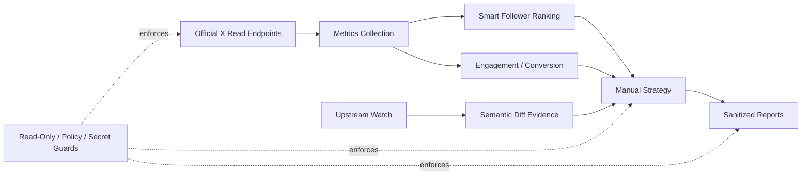

# Architecture

Owner: **SamAlpha1** · X: **@samalpha_**

## Flow

1. **Upstream Watcher** reads the current public recommendation source commit and relevant changed paths.
2. **Semantic Diff / Signal Extraction** separates executable source changes from metadata/comment-only changes and retains commit/path evidence.
3. **Read-Only X Client** collects permitted account, post, and bounded follower data through official GET endpoints.
4. **Scoring Layer** ranks accounts and followers with clearly labeled project heuristics and explicit evidence coverage.
5. **Measurement Layer** computes impression velocity, engagement quality, conversion measurements, and anomaly signals.
6. **Strategy Layer** produces manual-only recommendations.
7. **Reporting Layer** writes sanitized summaries and generated artifacts while runtime analytics remain gitignored.
8. **Safety Layer** blocks write methods/scopes/capabilities and protects credentials.

## Separation of evidence

Upstream-derived evidence and project scoring heuristics are separate data domains. A changed upstream path is not treated as proof that a ranking weight changed. Numeric extraction must retain source path, commit SHA, timestamp, exact parsed evidence, and confidence/evidence level.

## Runtime

The supported deployment target is GitHub Actions. Workflows have finite timeouts, bounded retries, least-privilege permissions, and no dependency on local machines.
